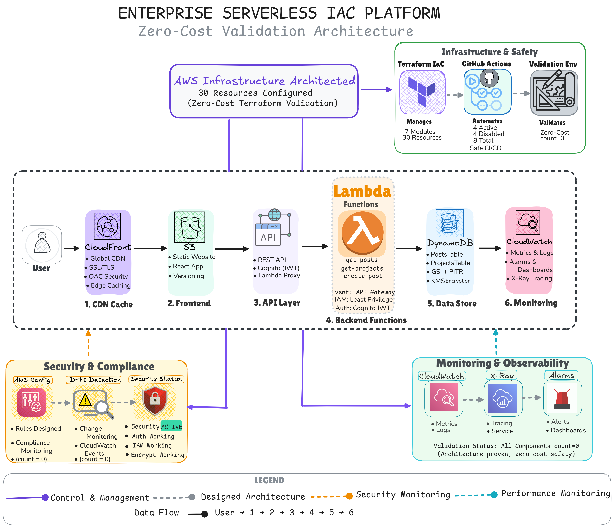
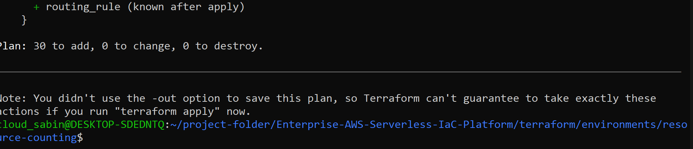
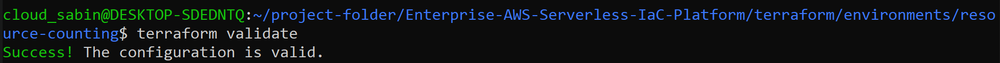
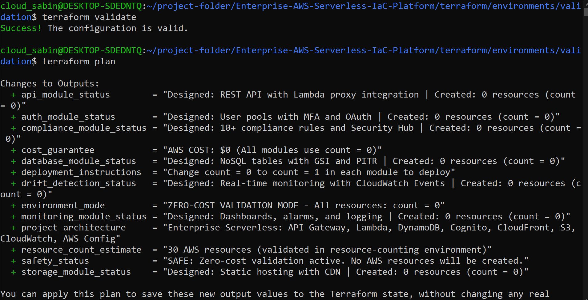
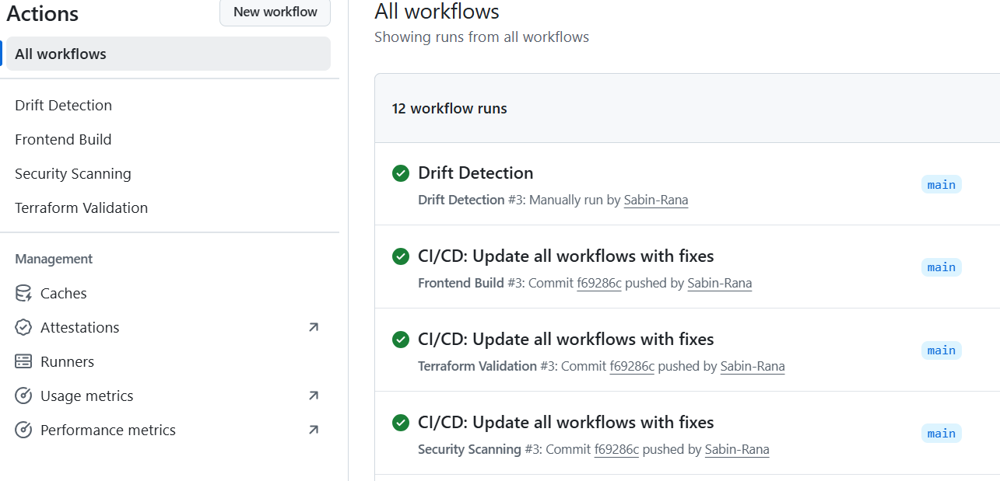
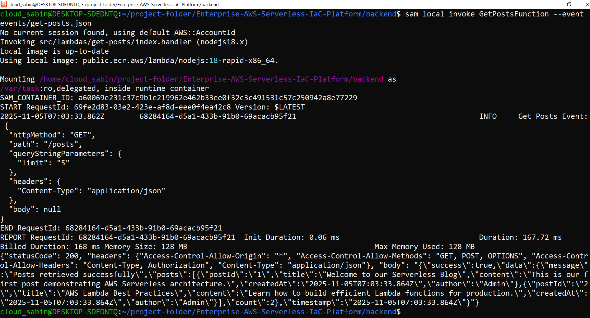
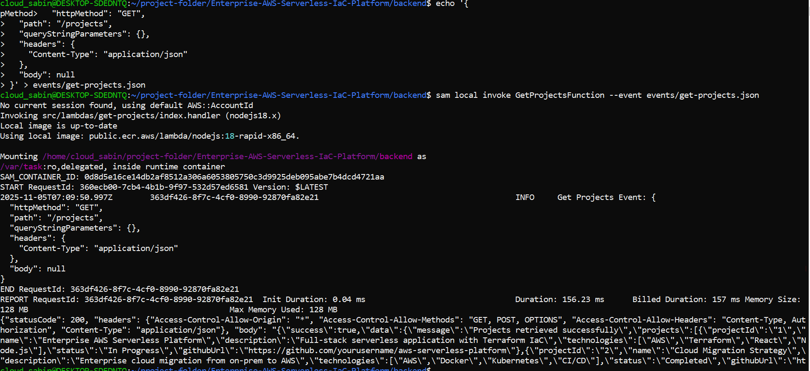
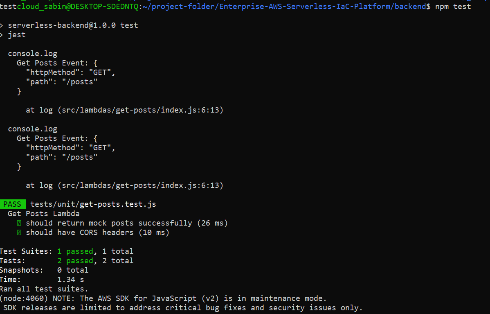
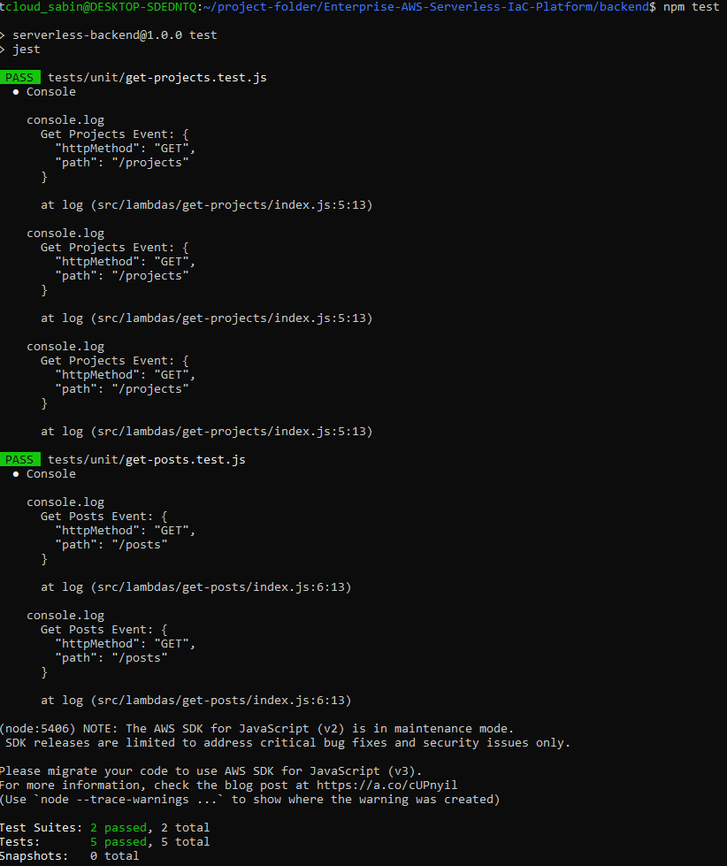
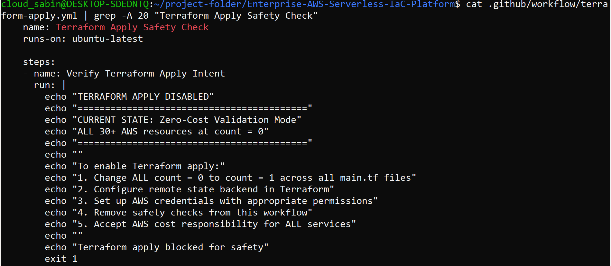

# Enterprise AWS Serverless IaC Platform

**Infrastructure as Code with Zero-Cost Validation & Enterprise Compliance**

Part of the "$0 Cloud Validation" series - Complete serverless architecture designed and validated without any cost.

A comprehensive enterprise-grade AWS serverless platform demonstrating modern cloud architecture with AWS Config compliance, drift detection, and full-stack application readiness - all validated through strategic zero-cost methodology.

[](https://opensource.org/licenses/MIT)
[](https://github.com/Sabin-Rana/Enterprise-AWS-Serverless-IaC-Platform)
[](https://www.terraform.io/)
[](https://aws.amazon.com/)
[]()
[]()
[]()
[]()

---

## Contents

- [Project Metrics](#project-metrics)
- [Architecture Diagram](#architecture-diagram)
- [Architecture Deep Dive](#architecture-deep-dive)
- [Cloud Engineering Progression](#cloud-engineering-progression)
- [Project Highlights](#project-highlights)
- [Validation Evidence](#validation-evidence)
- [Architecture Overview](#architecture-overview)
- [Safety Implementation](#safety-implementation)
- [Technical Stack](#technical-stack)
- [Getting Started](#getting-started)
- [Project Structure](#project-structure)
- [Professional Value](#professional-value)
- [Troubleshooting Journey](#troubleshooting-journey)
- [License](#license)

---

## Project Metrics

| Metric | Value |
|--------|-------|
| AWS Resources | 30 |
| Terraform Modules | 7 |
| CI/CD Workflows | 4 Active + 4 Disabled |
| Validation Evidence | 46 Screenshots |
| Development Cost | $0 |
| Services Integrated | 11 AWS Services |

### Project Validation

This project demonstrates enterprise-grade serverless architecture validated through strategic zero-cost methodology with comprehensive evidence collection.

**What makes this approach revolutionary:**

- Complete serverless infrastructure with AWS Config compliance patterns
- 43-step evidence portfolio documenting real-world troubleshooting
- Architecture design and planning without deployment risks
- Advanced patterns: drift detection, compliance monitoring, multi-environment strategies
- Zero financial barrier to learning enterprise cloud architecture

The methodology proves that comprehensive cloud engineering skills can be developed and demonstrated without financial risk.

---

## Architecture Diagram



*Complete 30-resource AWS serverless infrastructure with compliance monitoring and drift detection*

---

## Architecture Deep Dive

Want to understand how this entire architecture works? Read the complete technical breakdown:

**[Building an Enterprise Serverless Platform with Terraform: Architecture, Validation, and Real-World Implementation](https://sabin-codeops.hashnode.dev/building-an-enterprise-serverless-platform-with-terraform-architecture-validation-and-real-world-implementation)**

This blog post walks through:
- Detailed architecture explanation of all 30 resources
- The validation methodology and local testing approach
- Step-by-step user flow through the application
- Technical implementation decisions and why they matter
- The complete learning journey that led to this project

---

## Cloud Engineering Progression

This enterprise serverless platform represents the culmination of a structured learning path covering both traditional and modern AWS architectures, from manual implementation to advanced automation.

### Phase 1: Manual AWS Foundations

#### [Manual AWS 3-Tier Architecture](https://github.com/Sabin-Rana/aws-3tier-architecture)
- **Focus**: Traditional infrastructure fundamentals
- 115+ documented console implementation steps
- VPC, ALB, EC2 Auto Scaling, RDS Multi-AZ deployment
- **Skills Gained**: Deep AWS service understanding, networking, compute
- **Repository**: [aws-3tier-architecture](https://github.com/Sabin-Rana/aws-3tier-architecture)

#### [Manual Serverless Web Application](https://github.com/Sabin-Rana/aws-serverless-architecture-showcase)
- **Focus**: Serverless fundamentals
- Student data management system
- Lambda, API Gateway, DynamoDB, S3, CloudFront
- **Skills Gained**: Event-driven architecture, NoSQL, serverless patterns
- **Repository**: [aws-serverless-architecture-showcase](https://github.com/Sabin-Rana/aws-serverless-architecture-showcase)

### Phase 2: Infrastructure as Code Foundation

#### [Terraform Learning Journey](https://github.com/Sabin-Rana/terraform-learning-journey)
- Structured IaC curriculum with hands-on labs
- Configuration management and state handling
- **Skills Gained**: Terraform fundamentals, automation principles
- **Repository**: [terraform-learning-journey](https://github.com/Sabin-Rana/terraform-learning-journey)

### Phase 3: Infrastructure Automation

#### [Terraform AWS 3-Tier Architecture](https://github.com/Sabin-Rana/enterprise-aws-3tier-architecture)
- **Focus**: Traditional architecture automation
- 57 AWS resources across 6 Terraform modules
- Zero-cost validation methodology
- CI/CD implementation with GitHub Actions
- **Skills Gained**: Enterprise IaC patterns, cost governance
- **Repository**: [enterprise-aws-3tier-architecture](https://github.com/Sabin-Rana/enterprise-aws-3tier-architecture)

#### Enterprise Serverless Platform (Current Project)
- **Focus**: Modern serverless automation with compliance
- 30 resources, serverless-first design
- AWS Config compliance and drift detection
- Complete serverless application with React frontend and Lambda backend
- **Skills Gained**: Advanced serverless, compliance automation, enterprise patterns
- **Repository**: [Enterprise-AWS-Serverless-IaC-Platform](https://github.com/Sabin-Rana/Enterprise-AWS-Serverless-IaC-Platform)

---

### Evolution Timeline

```
MANUAL FOUNDATIONS      IaC LEARNING       AUTOMATED ENTERPRISE
─────────────────────────────────────────────────────────────────────
       │                      │                      │
       ├─ Manual 3-Tier       ├─ Terraform           ├─ Terraform 3-Tier
       │  (Traditional)       │  Labs                │  (57 resources)
       │                      │                      │
       ├─ Manual Serverless   │                      ├─ Enterprise Serverless
       │  (Student App)       │                      │  (Current - 30 resources)
       │                      │                      │
       └─ Console Mastery     └─ IaC Foundation      └─ Deployment-Ready
```

### Architecture Comparison

| Project | Type | Resources | Approach | Focus Area |
|---------|------|-----------|----------|------------|
| Manual 3-Tier | Traditional | N/A | Console | Infrastructure basics |
| Manual Serverless | Serverless | N/A | Console | Serverless patterns |
| Terraform 3-Tier | Traditional | 57 | IaC | Enterprise automation |
| Enterprise Serverless | Serverless | 30 | IaC | Modern and Compliance |

### Key Learning Insights

- **Manual First, Automate Later**: Understanding services deeply before automation
- **Both Paradigms**: Mastery of traditional AND serverless architectures
- **Progressive Complexity**: Each project builds advanced skills
- **Cost-Conscious**: Zero-cost validation methodology across automated projects
- **Real-World Patterns**: From learning to deployment-ready implementations

---

## Project Highlights

A comprehensive enterprise-grade AWS serverless platform demonstrating modern cloud architecture with AWS Config compliance, drift detection, and complete serverless application architecture - all validated through strategic zero-cost methodology.

### Key Achievements

- 30 AWS Resources architected with serverless-first design
- 7 Terraform Modules implementing enterprise patterns
- AWS Config Compliance rules designed for security monitoring
- Drift Detection System with real-time change monitoring
- Complete Serverless Application with React frontend and Lambda backend integration
- 4 CI/CD Workflows with safety-first validation
- Zero-Cost Validation via comprehensive Terraform planning

---

## Validation Evidence

<div align="center">

### 30-Resource Infrastructure Validated

*Complete 30-resource serverless infrastructure planned and validated with zero costs*

### Infrastructure Validation Success

*All 7 Terraform modules validated successfully with zero configuration errors*

### Zero-Cost Safety Confirmed

*Validation environment proves complete architecture without any AWS resource creation*

### CI/CD Pipeline - All Green

*All 4 validation workflows executing successfully with automated security scanning*

### Backend API - Local Testing Success

*Lambda functions tested locally with SAM CLI - GET posts endpoint working*

### Backend API - Create Post Success

*POST endpoint tested locally - blog post creation functionality verified*

### Backend API - Projects Endpoint Success

*GET projects endpoint tested locally - portfolio data retrieval working*

### Lambda Unit Tests Passing

*Lambda function unit tests executing successfully with proper test coverage*

### Complete Test Suite Success

*All Lambda function unit tests passing - comprehensive backend validation*

### Safety Mechanisms Active

*Deployment workflows disabled with manual triggers for cost protection*

</div>

---

**Complete Evidence Collection:**

All development logs and troubleshooting scenarios are documented in `/docs/screenshots-organized/`:

- CI/CD Workflows: 11 files showing pipeline development and validation
- Terraform Errors: 12 files documenting configuration issues and resolutions  
- Terraform Plans: 5 files proving successful infrastructure validation
- Backend Lambda: 5 files showing unit tests and SAM CLI testing
- Frontend Logs: 6 files documenting React development and build processes
- SAM CLI Validation: 3 files showing local endpoint testing
- Terraform Linting: 3 files showing tflint validation across modules
- Troubleshooting Progress: 1 file comparing error states and fixes

Total: 46 screenshots documenting the complete development journey

---

## Architecture Overview

### API Gateway and Lambda Module

REST API with regional endpoints for low-latency performance. Lambda functions with configuration including memory optimization, timeout settings, and environment variables.

**API Endpoints:**
- GET /posts - Blog posts retrieval with pagination
- POST /posts - Blog post creation (Cognito protected)
- GET /projects - Portfolio projects listing
- Authentication endpoints with JWT token management

### DynamoDB Database Module

NoSQL tables with provisioned capacity and auto-scaling readiness. Global Secondary Indexes for flexible query patterns. Point-in-time recovery enabled for data protection with server-side encryption.

**Table Design:**
- PostsTable - Blog content with title, content, metadata
- ProjectsTable - Portfolio projects with skills, links, descriptions
- Optimized key design for efficient query patterns

### Cognito Authentication Module

User Pools with MFA configuration and advanced security features. Identity Pools for AWS resource access with fine-grained IAM policies. OAuth 2.0 flows with proper callback URL management.

**Authentication Flow:**
```
User → React App → Cognito Hosted UI → JWT Token → API Gateway Authorizer → Lambda
```

### S3 and CloudFront Storage Module

Static website hosting with versioning and lifecycle policies. Global CDN distribution with Origin Access Control for security. SSL certificate configuration with custom domain support.

**Frontend Delivery:**
```
React SPA → S3 Origin → CloudFront Edge Locations → Global Users
```

### CloudWatch Monitoring Module

Centralized dashboards for API performance, Lambda metrics, and cost monitoring. Metric alarms for error rates, latency thresholds, and resource utilization. X-Ray tracing for distributed system monitoring.

**Monitoring Coverage:**
- Lambda execution duration and error rates
- API Gateway latency and throttling
- DynamoDB read/write capacity
- Application performance insights

### AWS Config Compliance Module

Continuous compliance monitoring with 10+ security rules. Config Recorder for resource configuration tracking. Security Hub integration for centralized findings management.

**Compliance Rules:**
- lambda-function-public-access-prohibited
- dynamodb-pitr-enabled
- api-gw-execution-logging-enabled
- cloudwatch-alarm-config-rule
- s3-bucket-public-read-prohibited

### Drift Detection Module

Real-time infrastructure change monitoring with CloudWatch Events. Scheduled Terraform plans for configuration drift detection. Custom Lambda functions for analysis and SNS notifications for alerts.

**Detection Strategy:**
- Weekly Terraform plan comparisons
- Real-time CloudWatch event monitoring
- Automated alerting for configuration changes
- Custom drift analysis logic

---

## Safety Implementation

### CI/CD Pipeline Strategy

**Active Workflows (Safe Validation):**
- Terraform Validation: Syntax checking, configuration validation, planning only
- Security Scanning: Code quality, vulnerability assessment with continue-on-error
- Frontend Build: React application compilation and testing
- Drift Detection: Configuration monitoring and change detection

**Disabled Workflows (Safety Measure):**
- Serverless Deployment: Lambda function deployment
- Frontend Deployment: S3 sync and CloudFront invalidation
- Terraform Apply: AWS resource creation

### Zero-Cost Validation Approach

**Count Parameter Safety:**

```hcl
resource "aws_lambda_function" "api" {
  # ============================================================================
  # ZERO-COST VALIDATION - DEPLOYMENT CONTROL
  # ============================================================================
  # CURRENT: count = 0 (Validation Mode)
  #   - Shows in terraform plan as "will not be created"
  #   - Demonstrates complete configuration
  #   - Maintains $0 AWS costs
  #
  # FOR DEPLOYMENT: Change to count = 1
  #   - Creates actual AWS resource
  #   - Incurs standard service pricing
  # ============================================================================
  count = 0
  
  function_name = "${var.project_name}-api"
  # ... full configuration
}
```

**Validation Benefits:**

- 30 AWS resources visible in Terraform plan output
- Professional documentation with plan evidence
- GitHub Actions validation without costs
- Architecture design and planning without financial risk
- Deployment ready - simple count change activates

**Deployment Readiness Verification:**

To prove this infrastructure is deployment-ready and not just theoretical, I tested with count set to 1:

- Changed count parameter from 0 to 1 across all resources
- Ran `terraform plan` showing all 30 resources ready for creation
- Captured screenshots as evidence of deployment readiness
- Reverted back to count = 0 for safe validation mode

The repository includes both configurations:
- `main.tf` - Current validation mode (count = 0)
- `main.tf.with-count-1` - Deployment-ready configuration with screenshots

This demonstrates the architecture is tested and verified, ready to deploy with a simple count parameter change.

### Validation Scripts Suite

5 Safety and Automation Scripts:

- `cost-validator.sh` - Comprehensive cost auditing and free-tier validation
- `safety-check.sh` - Pre-validation safety checks and environment verification
- `analyzer.sh` - Terraform plan analysis and resource counting
- `validation-manager.sh` - Validation environment management
- `stop.sh` - Emergency procedures documentation
- `tflint` - Terraform configuration linting across all modules

---

## Technical Stack

### Infrastructure and DevOps

- **Terraform** - Infrastructure as Code managing 30 AWS resources across 7 modules
- **tflint** - Terraform linting and configuration validation
- **GitHub Actions** - CI/CD pipeline with 4 active validation workflows
- **AWS SAM CLI** - Local Lambda testing and API simulation
- **DynamoDB Local** - Local database testing without AWS

### AWS Services

- **Compute**: AWS Lambda, Lambda Layers
- **API Management**: API Gateway (REST), WebSocket support
- **Database**: DynamoDB with GSIs and auto-scaling
- **Authentication**: Cognito User Pools, Identity Pools
- **Storage**: S3, CloudFront CDN
- **Monitoring**: CloudWatch, X-Ray, CloudWatch Logs
- **Security**: IAM, KMS, AWS Config, Security Hub
- **Networking**: Route53, ACM

### Application Stack

- **Frontend**: React 18, Vite 5.4, Modern JavaScript, CSS Modules
- **Backend**: Node.js Lambda functions, JWT authentication, DynamoDB client
- **Testing**: Jest, React Testing Library, SAM local testing
- **Build Tools**: npm, webpack, Babel configuration

---

## Getting Started

This complete architecture can be validated locally without any AWS account or costs.

### For Learners (No AWS Account Needed)

Clone and validate the infrastructure:

```bash
# Clone the repository
git clone https://github.com/Sabin-Rana/Enterprise-AWS-Serverless-IaC-Platform
cd Enterprise-AWS-Serverless-IaC-Platform

# Validate Terraform configuration
cd terraform/environments/validation
terraform init -backend=false
terraform validate
terraform plan

# You will see all 30 resources planned without any AWS charges
```

### Application Validation

Test the complete application locally:

```bash
# Backend validation with SAM CLI
cd backend
npm install
npm test
sam local invoke GetPostsFunction

# Frontend validation
cd frontend  
npm install
npm run build
npm run dev
```

### Safety Verification

```bash
# Comprehensive cost validation
./scripts/cost-management/cost-validator.sh

# Safety checks
./scripts/safety-check.sh

# Terraform analysis
./scripts/terraform-validation/analyzer.sh
```

---

## Project Structure

```
Enterprise-AWS-Serverless-IaC-Platform/
├── .github/workflows/              # CI/CD Pipeline
│   ├── terraform-validation.yml   # Infrastructure validation
│   ├── security-scan.yml          # Security scanning
│   ├── frontend-build.yml         # Frontend validation
│   ├── drift-detection.yml        # Configuration monitoring
│   └── disabled/                  # Disabled deployment workflows
├── terraform/                      # Infrastructure as Code
│   ├── modules/                   # 7 Terraform modules
│   │   ├── api/                  # API Gateway + Lambda
│   │   ├── auth/                 # Cognito Authentication
│   │   ├── database/             # DynamoDB
│   │   ├── storage/              # S3 + CloudFront
│   │   ├── monitoring/           # CloudWatch + X-Ray
│   │   ├── compliance/           # AWS Config Rules
│   │   └── drift-detection/      # Change Detection
│   └── environments/
│       ├── validation/           # Zero-cost safety
│       ├── resource-counting/    # Architecture validation
│       └── blueprints/           # Multi-environment patterns
├── frontend/                       # React Application
│   ├── src/
│   │   ├── App.jsx               # Main application
│   │   ├── components/           # Blog and Portfolio components
│   │   ├── services/             # API integration
│   │   └── styles/               # CSS styling
│   └── public/
├── backend/                        # Lambda Functions
│   ├── src/
│   │   ├── lambdas/              # 3 Lambda functions + tests
│   │   └── shared/               # Database and response utilities
│   └── template.yaml             # SAM configuration
├── scripts/                        # Safety and Automation
│   ├── cost-management/
│   ├── terraform-validation/
│   ├── validation-control/
│   └── emergency/
└── docs/                          # Comprehensive Evidence
    ├── architecture/
    │   └── aws-serverless-iac-architecture-diagram.png
    └── screenshots-organized/     # 46 validation screenshots
        ├── cicd-workflows/        # 11 CI/CD evidence files
        ├── terraform-errors/      # 12 troubleshooting files
        ├── terraform-plans/       # 5 success milestones
        ├── backend-lambda-validation/ # 5 testing files
        ├── frontend-logs/         # 6 development files
        ├── sam-cli-validation/    # 3 local testing files
        ├── terraform-linting/     # 3 tflint validation files
        └── troubleshooting-progress/ # 1 resolution file
```

---

## Professional Value

This project demonstrates enterprise-level skills in:

- **Modern Cloud Architecture** - Serverless-first design with auto-scaling and pay-per-use pricing
- **Infrastructure as Code** - 30-resource Terraform configuration with modular design
- **Compliance and Governance** - AWS Config rules, security monitoring, and drift detection
- **DevOps and CI/CD** - Pipeline design with safety controls and automated validation
- **Cost Optimization** - Zero-cost validation methodology proving financial responsibility
- **Security Implementation** - IAM least privilege, Cognito authentication, encryption
- **Monitoring and Observability** - CloudWatch dashboards, X-Ray tracing, custom metrics
- **Problem Solving** - 43+ documented troubleshooting scenarios with systematic resolution
- **Application Architecture** - Designed complete serverless application with frontend delivery, API layer, and backend data persistence
- **Documentation Excellence** - Professional evidence portfolio and architecture documentation

---

## Troubleshooting Journey

Complete Local Development Validation Evidence in `/docs/screenshots-organized/`

### Infrastructure Validation

- **Terraform Configuration**: 15+ configuration errors resolved across 7 modules including duplicate variables, invalid ARN formats, and resource reference mismatches
- **Cross-Module Dependencies**: Reference resolution and variable management between API, database, and authentication modules
- **AWS Service Constraints**: X-Ray naming limitations (32-character rule) and service-specific parameter validation
- **Provider Configuration**: Environment-specific AWS provider setup and validation

### CI/CD Pipeline Development & Validation

- **YAML Syntax Validation**: Local lint testing for GitHub Actions workflows before pushing to repository
- **Workflow Optimization**: Pre-push syntax validation, dependency resolution, and error correction
- **Safety Implementation**: Deployment workflow verification and validation-only execution patterns
- **Pipeline Testing**: Local workflow testing and GitHub Actions integration validation

### Application Development

- **Frontend Development**: React Vite configuration, JSX resolution, and development server setup
- **Backend Testing**: Lambda function unit tests, SAM CLI local invocation, and event simulation
- **Integration Testing**: Frontend-backend API connection validation and CORS configuration
- **Local Development**: Complete local environment setup with hot-reload and testing workflows

Comprehensive evidence showing real-world cloud engineering challenges and solutions from local development and testing, demonstrating systematic problem-solving approach.

---

## License

This project is licensed under the MIT License - see the [LICENSE](LICENSE) file for details.

Free to use, modify, and distribute. Commercial use permitted. Attribution required.

---

## Author and Contact

**Sabin Rana**

- **GitHub**: [Sabin-Rana](https://github.com/Sabin-Rana)
- **LinkedIn**: [Sabin Rana](https://www.linkedin.com/in/sabin-rana/)
- **Blog**: [Hashnode](https://sabinrana.hashnode.dev/)
- **Certifications**: [Credly Profile](https://www.credly.com/users/sabin-rana)

---

## If This Helps You

⭐ Star this repository if you find the serverless architecture and zero-cost validation approach valuable for your cloud learning journey.

Share it with others who want to learn modern cloud infrastructure without financial risk.